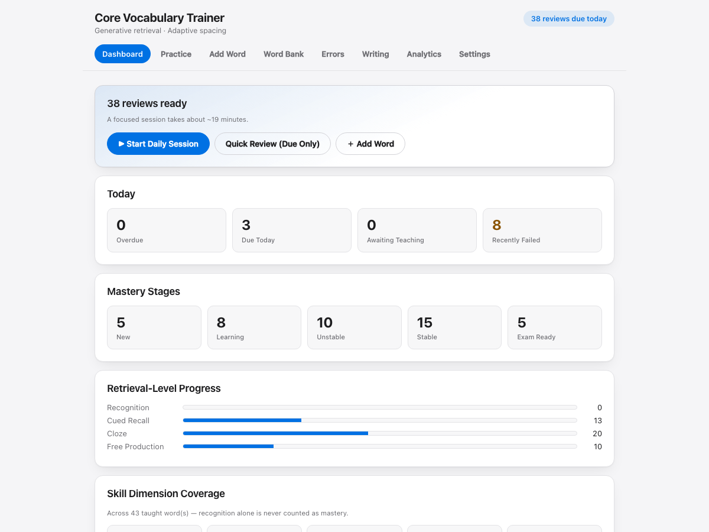
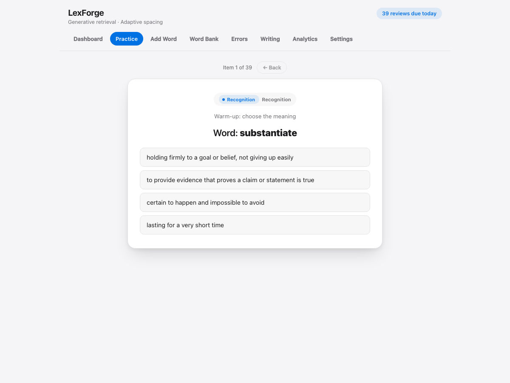
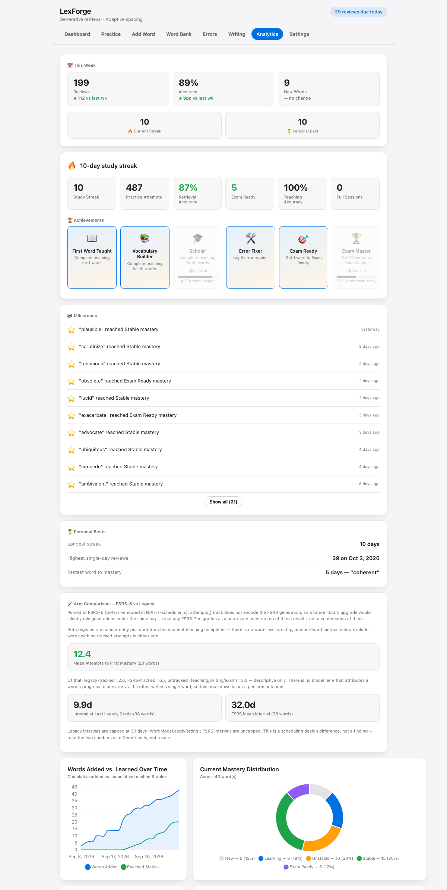

# LexForge

A single-file vocabulary trainer that refuses to call a word mastered until you can write with it.


**Live demo:** <PAGES_URL>

## Screenshots





The screenshots use a synthetic data set generated for this README, not real study data.

## What makes it different

- Eleven skill dimensions per word, not one.
- Production is required for mastery, not optional.
- Every mistake is diagnosed into one of seven categories.
- FSRS-6 spaced repetition, scheduled per-skill.
- Teaching before retrieval — no word enters practice until it's been taught.

## Features

**Teaching phase**
- Guided eight-step flow for each new word: introduction, core meaning, contextual examples, guided processing, supported retrieval, constrained production, independent production, entering retrieval.
- Add words one at a time, or paste many at once in a pipe-delimited format. The app includes a prompt you can give an AI assistant to generate that format.

**Practice engine**
- Daily Session, Quick Review (due items only), and context/production drills.
- Question types cover recognition, cued recall, cloze, and free production.
- Each word is tracked across eleven dimensions: form recognition, form recall, meaning recognition, meaning recall, semantic discrimination, grammar, collocation, contextual comprehension, guided production, independent production, and novel application.
- Mastery stages are New, Learning, Unstable, Stable, and Exam Ready. Exam Ready requires successful independent production and novel application, not recognition alone.

**Scheduling (FSRS-6 + legacy ladder)**
- Recognition, meaning recall, and production are scheduled by FSRS-6 (via the vendored `ts-fsrs`), one card per word and skill.
- Production cards unlock once recognition stability passes a threshold.
- The other dimensions still use the original level-based ladder with fixed intervals. The two systems run side by side.
- An optional exam date compresses review intervals for words that are not yet Exam Ready.

**Writing Audit + Timed Exam**
- Weekly Writing Audit: paste your own writing and tag errors against words in your bank. Matched errors feed back into scheduling.
- Timed Exam: write to a prompt under a timer with target words, then mark which ones you used correctly.

**Analytics**
- Weekly activity versus the prior week, streaks, achievements, and a milestone list.
- Words added versus words reaching Stable, mastery distribution, upcoming review load, and a per-dimension coverage table.
- Scheduler diagnostics: prediction calibration, stability growth, retention by interval, and an activity heatmap.

**Privacy**
- All data lives in your browser's `localStorage`. There is no server and no account.
- Export and import (merge or replace) as a JSON file from Settings.
- Everything the app needs, including Chart.js and the FSRS library, is vendored in `lib/`. The app makes no network requests.

## Try it

- Live demo: <PAGES_URL>
- Run locally: open `index.html` in a browser. No server, no build, no install.

## Tests

```
node --test tests/*.test.js
```

Requires Node.js. The glob is needed; `node --test tests/` alone finds nothing.

## Project layout

- `index.html` — the whole app: markup, styles, and one inline script.
- `lib/` — FSRS scheduling and due-queue modules, shared by the app and the tests, plus the vendored `ts-fsrs` and Chart.js builds.
- `tests/` — unit and smoke tests. The persistence smoke test loads the real script out of `index.html`.
- `docs/` — README screenshots.

See [CONTRIBUTING.md](CONTRIBUTING.md) to work on it, and [CONTEXT.md](CONTEXT.md) for a file and function map.

## License

MIT. See [LICENSE](LICENSE).

The root MIT license covers the original code in this repository. The vendored ts-fsrs and Chart.js builds in `lib/` carry their own licenses — see `lib/fsrs.LICENSE`, `lib/chart.LICENSE`, and [THIRD_PARTY_NOTICES.md](THIRD_PARTY_NOTICES.md) for details.

## Acknowledgments

- [ts-fsrs](https://github.com/open-spaced-repetition/ts-fsrs) — the FSRS implementation behind the scheduler.
- [Chart.js](https://www.chartjs.org/) — analytics charts.

## Known issues

Open bugs found during code review are tracked in [KNOWN_ISSUES.md](KNOWN_ISSUES.md).
