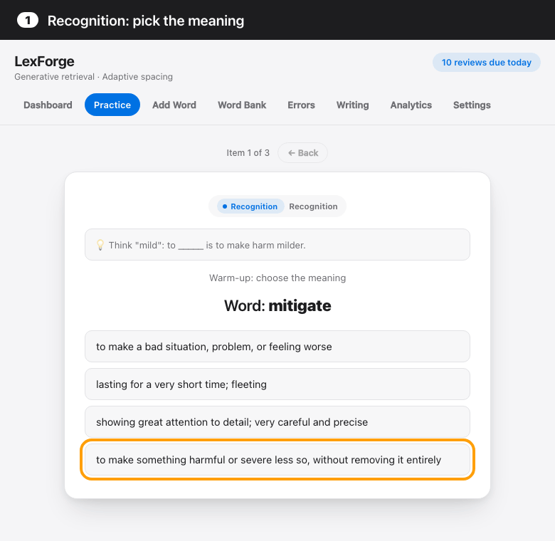
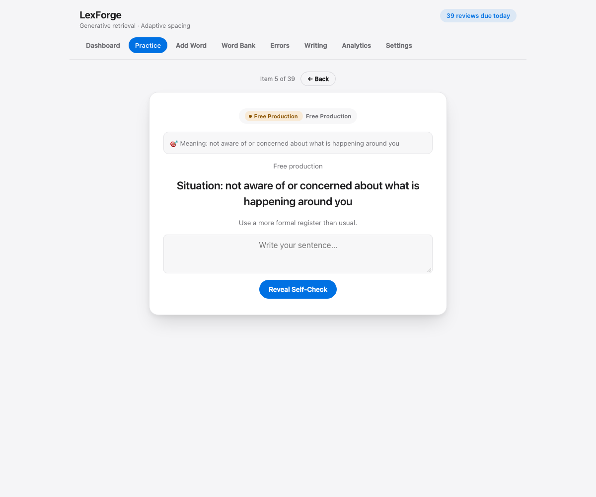

# LexForge — Productive Vocabulary Trainer

**Recognizing a word is the easiest part of knowing it — most vocabulary apps stop there. LexForge makes you produce it.**



### [Try it in your browser — no account, no install →](https://da-boss-is-here.github.io/Lexforge/)

On the first screen, click **Try with sample words** to go from recognition to writing your own sentence in one click. You judge your own sentences: free production is self-checked, and nothing in the app grades it.

  

[How it works ↓](#how-lexforge-works)

Recognizing a word is only one part of knowing it. LexForge tracks whether you can retrieve it, distinguish it, use it correctly, and produce it in writing.

**A word isn't Exam Ready just because you recognized it — LexForge requires successful independent production and novel application.**

- ✍️ Mastery requires real production
- 🧠 11 dimensions of vocabulary knowledge
- 🔎 7 categories of mistake diagnosis
- 📈 FSRS-6 scheduling for recognition, meaning recall, and production
- 🔒 Fully local — no account, no server, no network

## Why LexForge?

| Conventional flashcards | LexForge |
|---|---|
| Recognition can feel like mastery | Mastery requires production |
| One-dimensional card state | 11 skill dimensions |
| Wrong answer → mark incorrect | Diagnose the type of mistake |
| Review at the word/card level | FSRS-6 for recognition, meaning recall, and production |
| Practice centers on retrieval | Teach → retrieve → produce |
| In-app exercises | Writing Audit tests real usage |

## Why I built this

I kept noticing a problem with vocabulary apps: recognizing a word feels like knowing it, but recognition and actual use are very different skills.

A student can recognize *substantiate* in a multiple-choice question and still fail to retrieve it, distinguish it from *prove*, use the wrong preposition, or avoid using it in writing entirely.

So I built LexForge around the idea that vocabulary mastery should end in production, not recognition.

## How LexForge works

```text
Teach → Retrieve → Produce → Diagnose → Schedule → Apply in writing
```

1. **Teach.** Every new word goes through a guided eight-step flow, from introduction and contextual examples to constrained and independent production. No word enters practice until it has been taught.
2. **Retrieve.** Recognition, cued recall, and cloze questions check that you can bring the word to mind, in a Daily Session, a due-only Quick Review, or targeted drills.
3. **Produce.** Free production gives you a situation and asks you to write your own sentence with the word, then check it yourself.
4. **Diagnose.** A mistake isn't just marked wrong. It's sorted into one of seven categories (Meaning, Form, Spelling, Grammar, Collocation, Register, Selection) and tied to the skill dimension it affects.
5. **Schedule.** Recognition, meaning recall, and production each get their own FSRS-6 card per word, and production cards unlock once recognition is stable. The other dimensions use an older level-based ladder.
6. **Apply in writing.** The Writing Audit lets you paste your own writing and tag errors against words in your bank, and matched errors feed back into scheduling. A word reaches Exam Ready only once independent production and novel application have both succeeded.

## Screenshots

The workflow, from the dashboard to a production question to analytics.




The screenshots use a synthetic data set generated for this README, not real study data.

For a full walkthrough with screenshots of every screen, see [docs/WALKTHROUGH.md](docs/WALKTHROUGH.md).

  

## Features

**Teaching phase**
- Guided eight-step flow for each new word: introduction, core meaning, contextual examples, guided processing, supported retrieval, constrained production, independent production, entering retrieval.
- Add words one at a time, or paste many at once in a pipe-delimited format. The app includes a prompt you can give an AI assistant to generate that format.

**Practice engine**
- Daily Session, Quick Review (due items only), and context/production drills.
- Question types cover recognition, cued recall, cloze, and free production.
- Each word is tracked across eleven dimensions: form recognition, form recall, meaning recognition, meaning recall, semantic discrimination, grammar, collocation, contextual comprehension, guided production, independent production, and novel application.
- Mastery stages are New, Learning, Unstable, Stable, and Exam Ready. Exam Ready requires successful independent production and novel application, not recognition alone.

**Scheduling (FSRS-6 + legacy ladder)**
- Recognition, meaning recall, and production are scheduled by FSRS-6 (via the vendored `ts-fsrs`), one card per word and skill.
- Production cards unlock once recognition stability passes a threshold.
- The other dimensions still use the original level-based ladder with fixed intervals. The two systems run side by side.
- An optional exam date compresses review intervals for words that are not yet Exam Ready.

**Writing Audit + Timed Exam**
- Weekly Writing Audit: paste your own writing and tag errors against words in your bank. Matched errors feed back into scheduling.
- Timed Exam: write to a prompt under a timer with target words, then mark which ones you used correctly.

**Analytics**
- Weekly activity versus the prior week, streaks, achievements, and a milestone list.
- Words added versus words reaching Stable, mastery distribution, upcoming review load, and a per-dimension coverage table.
- Scheduler diagnostics: prediction calibration, stability growth, retention by interval, and an activity heatmap.

**Privacy**
- All data lives in your browser's `localStorage`. There is no server and no account.
- Export and import (merge or replace) as a JSON file from Settings.
- Everything the app needs, including Chart.js and the FSRS library, is vendored in `lib/`. The app makes no network requests.

## Try it

**Live demo:** https://da-boss-is-here.github.io/Lexforge/

**First run:** the bank starts empty. **Try with sample words** loads five demo words (flagged as sample data, removable from the Dashboard) and starts a short recognition → production round without the Teaching flow. Or add your own words.

**Run locally:** open `index.html` in a browser. No server, no build, no install. The app is one HTML file plus the libraries vendored in `lib/`.

## Tests

```
node --test tests/*.test.js
```

Requires Node.js. The glob is needed; `node --test tests/` alone finds nothing.

## Project layout

- `index.html` — the whole app: markup, styles, and one inline script.
- `lib/` — FSRS scheduling and due-queue modules, shared by the app and the tests, plus the vendored `ts-fsrs` and Chart.js builds.
- `tests/` — unit and smoke tests. The persistence smoke test loads the real script out of `index.html`.
- `assets/` — the README demo GIF/MP4, regenerated by `scripts/capture-demo.js` (dev-only; needs Playwright and ffmpeg, which the repo doesn't depend on).
- `docs/` — the [walkthrough](docs/WALKTHROUGH.md) and the screenshots used by it and the README.

See [CONTRIBUTING.md](CONTRIBUTING.md) to work on it, and [CONTEXT.md](CONTEXT.md) for a file and function map.

## License

MIT. See [LICENSE](LICENSE).

The root MIT license covers the original code in this repository. The vendored ts-fsrs and Chart.js builds in `lib/` carry their own licenses — see `lib/fsrs.LICENSE`, `lib/chart.LICENSE`, and [THIRD_PARTY_NOTICES.md](THIRD_PARTY_NOTICES.md) for details.

## Acknowledgments

- [ts-fsrs](https://github.com/open-spaced-repetition/ts-fsrs) — the FSRS implementation behind the scheduler.
- [Chart.js](https://www.chartjs.org/) — analytics charts.

## Known issues

Open bugs found during code review are tracked in [KNOWN_ISSUES.md](KNOWN_ISSUES.md).
